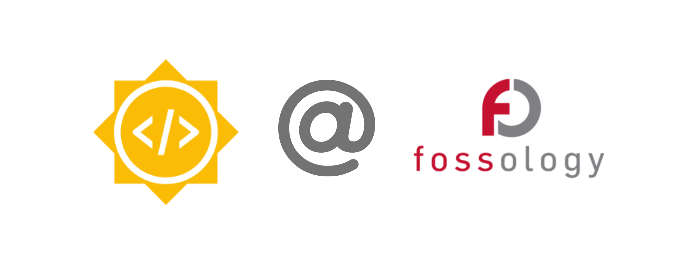

---

<p align="center">
  
</p>

<h1 align="center">📘 GSoC 2025 — Work Report</h1>

<h3 align="center">Project: Enhancing LicenseDB Platform (FOSSology)</h3>

<p align="center">
  This document represents my complete <b>Google Summer of Code 2025</b> work report for the project under 
  <a href="https://www.fossology.org/" target="_blank">FOSSology</a>.  
  It includes the full breakdown of deliverables, PRs, feature designs, implementations, and outcomes.
</p>

---


---

## 📌 About the Project
This year, I'm working with **FOSSology** under GSoC 2025 on **LicenseDB Platform Improvements**.  
The project focuses on enhancing LicenseDB with robust features like database migrations, rich text handling, Swagger 3.0 integration, structured logging, better search, and standardized API responses.

---

## 🛠️ Deliverables

- [x] **Database Migrations**  
  - Add support for database migrations using [golang-migrate/migrate](https://github.com/golang-migrate/migrate).
- [x] **Mail Notifications**  
  - Notify **admins**, **license creators**, and **project owners** when a license gets updated.
- [x] **Refresh Token Functionality**  
  - Implement refresh token support for secure and seamless authentication.
- [x] **New Monorepo Setup**  
  - Restructure the project into a unified **backend + frontend monorepo**.
- [x] **Minor Endpoint Improvements**
  - Add **changelogs** for user endpoints.
  - Provide **top X licenses/obligations** with similar text.
  - Improve **logging** and REST API responses.
- [x] **Test Coverage & Documentation**  
  - Improve **unit**, **functional**, and **API** test coverage.
---
## ✅ Database Migrations  
**PR:** [fossology/LicenseDB – #134](https://github.com/fossology/LicenseDb/pull/134)

#### 📍 Background  
In the context of the LicenseDB project, database migrations are essential to evolve the database schema reliably as new features get introduced. Before this work, LicenseDB lacked a standard migration system, making schema changes risky and non-versioned.

#### 🎯 Objective  
- Introduce database migration support using `golang-migrate/migrate`.
- Enable version-controlled, reversible, and safe schema upgrades.
- Ensure compatibility with existing and future database changes.

#### 🛠️ Technical Approach  
- Added a dedicated `migrations/` folder with versioned migration files (e.g., `0001_init.up.sql`, `0001_init.down.sql`).
- Integrated a migration runner to apply migrations on startup or via CLI.
- Added rollback support using `.down.sql` scripts.
- Enhanced error handling + logging for migration failures.
- Documented usage in README with guidelines for creating and running migrations.


#### 🧾 Outcome  
- Successfully integrated a robust schema migration system into LicenseDB.
- Developers can now safely introduce and track schema changes with version history.
- Reduced deployment risks and established a scalable foundation for future features.

---

## 🧪 Test Environment Setup & E2E Test Coverage

**PR:** https://github.com/fossology/LicenseDb/pull/137

**PR:** https://github.com/fossology/LicenseDb/pull/161

To ensure reliable and reproducible testing for the LicenseDB backend, I introduced a standardized test environment for both **local development** and **GitHub Actions CI**, along with end-to-end (E2E) test coverage.

---

#### ✅ Local & CI Test Environment

Previously, setting up tests required manual DB configuration, which caused inconsistent results.  
The new setup automates the entire testing workflow.

**Key Improvements:**
- Automatic creation of a **test PostgreSQL database**
- Database migrations applied before test execution
- Test data (admin, users, license creators) seeded automatically
- Automatic cleanup after tests to ensure isolation

**Run full backend test suite locally:**
```bash
go test ./...
```

This ensures developers can run tests on any machine with **one command**, without any extra setup.

### 🧪 E2E Test Coverage (~60–70%)

To validate real application behaviour rather than isolated unit scenarios, I added **end-to-end tests** covering major backend flows.

**Coverage Includes:**
- Authentication and token workflow  
- License creation, update, and retrieval  
- Migration compatibility testing  
- API behaviour with real PostgreSQL interactions  

This increased backend test coverage to **~60–70%**, providing greater stability and confidence in future development.

---
## 🔧 Minor Endpoint Improvements

As part of enhancing the API usability and maintainability, several improvements were made to user-related endpoints, logging, and data-fetching workflows.


### 📜 Changelogs for User Endpoints

Added support for **endpoint-level changelogs**, allowing users and admins to track what changed, when, and by whom.  
This increases transparency across updates made to user profiles or roles.

**Key Benefit:** Easier auditability and traceability of user actions.
**PR:** https://github.com/fossology/LicenseDb/pull/140

### 🔍 Fetch Licenses & Obligations by Text (Similarity Search)

To avoid duplication of licenses and obligations in LicenseDB, I implemented a **text-based similarity search** feature.  
This allows users to quickly find existing licenses or obligations that are similar to the text they are entering.

This feature was implemented for both **backend (API)** and **frontend (UI)**.

---

####  How It Works (pg_trgm + GIST Index)

The backend uses PostgreSQL’s **pg_trgm** (Trigram Matching) extension to compute similarity between text inputs.

**Key Components:**
- **pg_trgm** extension enables trigram-based fuzzy search  
- **GIST index** added on text columns to speed up similarity queries  
- Uses PostgreSQL `similarity()` and `%` operator for matching  

This ensures fast and accurate results even with large datasets.

**Similarity Threshold:**
- Default threshold: **0.7**
- Value can be overridden using an environment variable:
  ```env
  SIMILARITY_THRESHOLD=0.8
  ```
This gives flexibility to adjust the sensitivity of search results as needed.
####  Backend (API) — PR

- Added an endpoint to search licenses and obligations using similarity matching.  
- Returns a ranked list of closest matches based on text similarity.  
- Helps prevent duplicate creation of very similar licenses or obligations.  

**PR:** https://github.com/fossology/LicenseDb/pull/144


####  UI Integration — PR

- Added UI support to perform **live similarity checks** before creating a new license or obligation.  
- Displays suggested matches to users, along with the similarity score.  
- Improves UX by warning users if a similar entry already exists.  

**PR:** https://github.com/fossology/LicenseDb-UI/pull/30


#### 📝 Improved Logging with Zap

Replaced standard logging with **Zap Logger** for structured, performant, and context-rich logs.

**Enhancements Achieved:**
- Consistent log formatting across services  
- JSON-structured logs for better observability  
- Easier debugging and log filtering in production

**(Added Zap with the Refresh Token and Messaging System)**


## 🔐 Refresh Token Support for Password-Based Login

Earlier, the refresh token mechanism existed only for **OIDC-based users**, while users logging in through **email + password** had to re-authenticate frequently.  
To provide a seamless and secure login experience, I extended the refresh token functionality to support **password-based authentication** as well.

This ensures consistent token management across both login methods.

---

####  What Was Added

- Implemented **refresh token generation and rotation** for password-based login.
- Secure HTTP-only refresh tokens stored with expiry and automatic renewal.
- Unified token handling for both **OIDC users and Password users**.
- Improves session security while reducing repeated login prompts.

---

####  Backend (API) 

- Added refresh token issuing and renewal logic for password login flow.  
- Implemented token rotation, validation, and secure expiration handling.  


**PR:** https://github.com/fossology/LicenseDb/pull/145


####  Frontend Integration 

- Integrated refresh token flow on the UI to auto-renew access tokens.  
- Reduced forced logout scenarios for password-based users.  
- Ensures smooth user experience similar to OIDC login flow.  

**PR:** https://github.com/fossology/LicenseDb-UI/pull/26

## 🧱 New Monorepo Setup with Single Makefile + Docker Support

To unify development, builds, testing, and deployment, the project was migrated to a **monorepo structure** with a single root `Makefile` managing both backend and frontend workflows.

###  Monorepo Structure
```
/
│── Makefile                  # Central Makefile for monorepo
│── docker-compose.yml        # Runs backend + frontend together
│
│── backend/
│     ├── Dockerfile
│     ├── go.mod
│     └── ...
│
└── frontend/
      ├── Dockerfile
      ├── package.json
      └── ...

```
### 🧰 Single Makefile for Complete Monorepo Operations

A single Makefile at the root now handles everything for the monorepo, including:

- Running backend & frontend services
- Testing, linting, and formatting
- Database migrations
- Code generation & builds
- Docker & CI tasks

> To view all supported commands, simply run:
```bash
make
```


Key entry commands:

| Command | Purpose |
|---------|-----------|
| `make generate` | Generate required code/config |
| `make run-all` | Run backend & frontend locally |
| `make docker-up` | Start both services with Docker Compose |
| `make docker-down` | Stop Docker services |

> **Local setup flow:**  
> `make generate` → `make build` (optional) → `make run-all`

### 🐳 Docker + Compose Integrated

- Backend and frontend have their own Dockerfiles  
- Root `docker-compose.yml` enables one-command startup using Make  

Example:

```bash
make docker-up
```
### 🤖 GitHub Actions Updated for Monorepo

- CI pipelines updated to support monorepo structure

- Separate workflows for backend & frontend

- Added Docker build & push jobs for both services

**PR:** https://github.com/fossology/LicenseDb/pull/165

## ✉️ Messaging System – Email Notifications (GoMail v2)

A structured messaging system was implemented to send email notifications to **Admins** and **License Creators** whenever a license is updated.  
This system follows a clean, layered architecture to ensure reusability, testability, and scalability.

### 🏗️ Messaging System Architecture


### 🔧 Tech Used

| Component | Technology |
|-----------|-------------|
| Email Sending | **GoMail v2** |
| Rendering Templates | `.gohtml` + dynamic variables |
| Logging | `zap.Logger` |
| Config | Environment-based config for sender, host & SMTP auth |

### ✅ Key Features

- Sends **two separate personalized emails** for each license update:
  - One to Admin(s)
  - One to the License Creator
- Uses a wrapper layer to build email message bodies with dynamic values
- Template-based system for easy customization of email content
- Centralized logging for better error traceability
- Supports future extension (e.g., project owners, Slack, webhook, etc.)

### 📁 Template Driven

Email body formatting uses `.gohtml` templates maintained inside a dedicated folder.  
The wrapper **pulls templates** and injects values such as:

- License name
- Timestamp
- Change summary

###  Why This Architecture?

| Benefit | Description |
|---------|----------------|
| Clean Separation | Logic, templates, and email sending are isolated |
| Easy to Extend | Additional channels (SMS, Slack, Teams) can plug in |
| Testable | Wrapper and email service can be unit-tested independently |
| Customizable | Templates can be updated without code changes |

**PR:** https://github.com/fossology/LicenseDb/pull/158

---

## ✅ Final Summary

Throughout GSoC 2025, the goal of the project was to enhance the **LicenseDB platform** with improved architecture, better developer experience, stronger authentication, advanced search capabilities, and production-ready tooling.  
All major deliverables were successfully completed, reviewed, and merged — significantly improving LicenseDB’s stability, usability, and maintainability.

### 🔍 Key Impact Highlights

- Transformed LicenseDB into a more **reliable, testable, and scalable** system
- Introduced modern **monorepo architecture** improving dev workflow & CI/CD
- Strengthened security with **refresh token support & improved auth**
- Enhanced search accuracy using **GIST + pg_trgm similarity**
- Increased backend test coverage to **~70%**
- Delivered **email notification & messaging system** for better communication
- Improved user experience with similarity checks & UI enhancements
- Added structured logging, changelogs, and standardized API responses

---

## 🙌 Acknowledgements

I am deeply grateful to:
  
  
- **Mentor:** **[Dearsh Oberoi](https://github.com/deo002)**
  
  For their continuous guidance, design feedback, and valuable reviews.
- **FOSSology Community**  
  For their support, discussions, and collaborative spirit.

This journey not only enhanced my technical skills in Go, PostgreSQL, Monorepo systems, testing, and scalable architecture — but also taught me open-source collaboration, RFC-driven development, and community-first engineering.

---

## 🚀 What's Next?

Even after GSoC, I aim to continue contributing by:

- Supporting future contributors with onboarding & documentation
- Improving the text-similarity engine further with ML-based ranking
- Extending the messaging system to Slack / Webhooks
- Enhancing UI with real-time updates and better DX tools

---

<h3 align="center">💛 Thank You for the Opportunity!</h3>

<p align="center">It has been an honour to contribute to FOSSology through Google Summer of Code 2025.  
Looking forward to continuing this journey with the community.</p>

<p align="center"><b>— Chayan Das</b></p>
